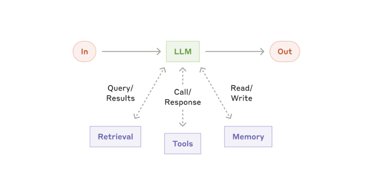
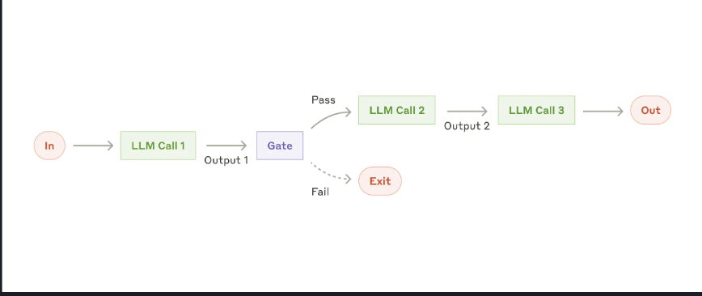
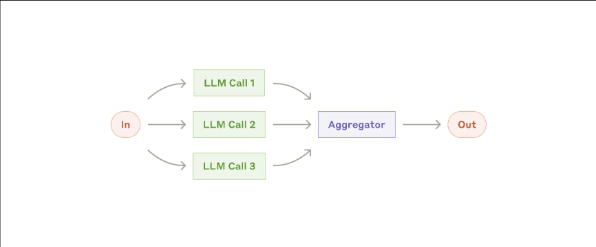
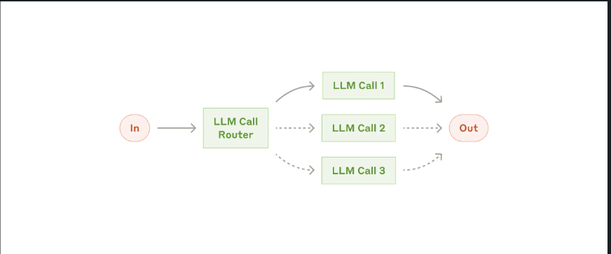
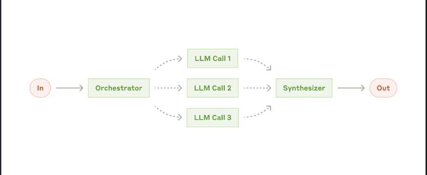
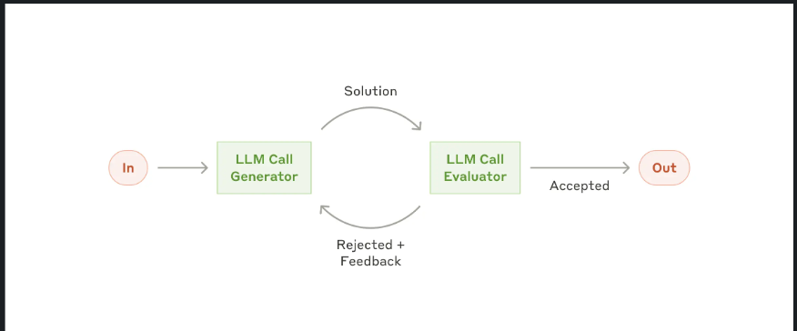

# Construindo Agentes Eficazes (Spring AI) — Resumo em Português

> Conversão para Markdown e tradução para PT-BR do conteúdo da página “Building Effective Agents” da documentação do Spring AI.  
> **Observação:** todo **código** foi mantido exatamente como no original (inglês).  
> Gerado em: 2025-09-16T16:07:33

---



## Visão Geral

Em uma publicação recente, a Anthropic apresentou **insights** relevantes sobre como construir agentes de LLM eficazes, com ênfase em **simplicidade** e **composabilidade** em vez de *frameworks* excessivamente complexos. Este guia traduz esses princípios para **implementações práticas com Spring AI**, aproveitando **portabilidade de modelos** e **saída estruturada**. Recomenda-se a leitura do artigo original antes de prosseguir.

O repositório `spring-ai-examples` possui um diretório com os exemplos citados aqui.

## Sistemas Agentivos

A publicação diferencia dois tipos de sistemas:

1. **Workflows** — LLMs e ferramentas orquestrados por **caminhos de código predefinidos** (sistemas prescritivos).
2. **Agents** — LLMs **direcionam dinamicamente** seu processo e uso de ferramentas.

A percepção-chave: embora agentes totalmente autônomos sejam atraentes, **workflows** geralmente entregam **maior previsibilidade e consistência** para tarefas bem definidas — alinhado a requisitos corporativos de **confiabilidade** e **manutenibilidade**.

A seguir, cinco **padrões fundamentais** com casos de uso típicos.

---

## 1) Chain Workflow (Encadeamento)



**Quando usar:**
- Tarefas com passos sequenciais claros
- Quando você aceita trocar **latência** por **maior acurácia**
- Quando cada etapa se apoia na saída da anterior

**Exemplo (Spring AI):**
```java
public class ChainWorkflow {
    private final ChatClient chatClient;
    private final String[] systemPrompts;

    public String chain(String userInput) {
        String response = userInput;
        for (String prompt : systemPrompts) {
            String input = String.format("{%s}\n {%s}", prompt, response);
            response = chatClient.prompt(input).call().content();
        }
        return response;
    }
}
```

**Princípios demonstrados:** responsabilidades focadas por etapa; **output** de uma etapa como **input** da seguinte; cadeia **extensível** e **mantível**.

---

## 2) Parallelization Workflow (Paralelização)



**Quando usar:**
- Grande volume de itens similares porém independentes
- Múltiplas perspectivas independentes
- Tempo de processamento crítico com tarefas paralelizáveis

**Exemplo (Spring AI):**
```java
List<String> parallelResponse = new ParallelizationWorkflow(chatClient)
    .parallel(
        "Analyze how market changes will impact this stakeholder group.",
        List.of(
            "Customers: ...",
            "Employees: ...",
            "Investors: ...",
            "Suppliers: ..."
        ),
        4
    );
```

---

## 3) Routing Workflow (Roteamento)



Implementa **distribuição inteligente** para tratamento especializado de cada tipo de entrada.

**Quando usar:**
- Tarefas complexas com **categorias distintas** de entrada
- Entradas que exigem **processamento especializado**
- Classificação precisa viável

**Exemplo (Spring AI):**
```java
@Autowired
private ChatClient chatClient;

RoutingWorkflow workflow = new RoutingWorkflow(chatClient);

Map<String, String> routes = Map.of(
    "billing", "You are a billing specialist. Help resolve billing issues...",
    "technical", "You are a technical support engineer. Help solve technical problems...",
    "general", "You are a customer service representative. Help with general inquiries..."
);

String input = "My account was charged twice last week";
String response = workflow.route(input, routes);
```

---

## 4) Orchestrator-Workers (Orquestrador-Trabalhadores)



**Quando usar:**
- Tarefas complexas com **subtarefas imprevisíveis** a priori
- Diferentes abordagens/perspectivas necessárias
- **Resolução adaptativa de problemas**

**Exemplo (Spring AI):**
```java
public class OrchestratorWorkersWorkflow {
    public WorkerResponse process(String taskDescription) {
        // 1. Orchestrator analyzes task and determines subtasks
        OrchestratorResponse orchestratorResponse = // ...

        // 2. Workers process subtasks in parallel
        List<String> workerResponses = // ...

        // 3. Results are combined into final response
        return new WorkerResponse(/*...*/);
    }
}

// Usage Example:
ChatClient chatClient = // ... initialize chat client
OrchestratorWorkersWorkflow workflow = new OrchestratorWorkersWorkflow(chatClient);

WorkerResponse response = workflow.process(
    "Generate both technical and user-friendly documentation for a REST API endpoint"
);

System.out.println("Analysis: " + response.analysis());
System.out.println("Worker Outputs: " + response.workerResponses());
```

---

## 5) Evaluator-Optimizer (Avaliador–Otimizador)



**Quando usar:**
- Existem **critérios claros de avaliação**
- **Refinamento iterativo** agrega valor mensurável
- Tarefas que se beneficiam de múltiplas rodadas de **crítica**

**Exemplo (Spring AI):**
```java
public class EvaluatorOptimizerWorkflow {
    public RefinedResponse loop(String task) {
        Generation generation = generate(task, context);
        EvaluationResponse evaluation = evaluate(generation.response(), task);
        return new RefinedResponse(finalSolution, chainOfThought);
    }
}

// Usage Example:
ChatClient chatClient = // ... initialize chat client
EvaluatorOptimizerWorkflow workflow = new EvaluatorOptimizerWorkflow(chatClient);

RefinedResponse response = workflow.loop(
    "Create a Java class implementing a thread-safe counter"
);

System.out.println("Final Solution: " + response.solution());
System.out.println("Evolution: " + response.chainOfThought());
```

---

## Vantagens na Implementação com Spring AI

### Portabilidade de Modelos
```xml
<dependency>
    <groupId>org.springframework.ai</groupId>
    <artifactId>spring-ai-openai-spring-boot-starter</artifactId>
</dependency>
```

### Saída Estruturada
```java
EvaluationResponse response = chatClient.prompt(prompt)
    .call()
    .entity(EvaluationResponse.class);
```

### API Consistente
- Interface uniforme entre provedores de LLM
- Tratamento de erros e *retries* embutidos
- Gestão flexível de *prompts*

---

## Boas Práticas e Recomendações

- **Comece simples**: inicie com workflows básicos, só adicione complexidade quando necessário.
- **Confiabilidade**: erros claros, respostas *type-safe*, validação em cada etapa.
- **Trade-offs**: equilibre **latência × acurácia**; avalie se paralelização ajuda; escolha entre **workflows fixos** e **agentes dinâmicos** conforme o caso.

---

## Trabalhos Futuros (na doc)

- **Composição de padrões** (híbridos)
- **Memória avançada** (persistente, janela de contexto, retenção)
- **Integração com ferramentas e MCP** (protocolos padronizados, arquiteturas extensíveis)

---

## Conclusão

Combinar os insights da Anthropic com as implementações práticas do Spring AI oferece uma abordagem poderosa para **sistemas efetivos baseados em LLM**. Comece pelo **mais simples**, compreenda seu **caso de uso**, e **só** adicione complexidade quando isso **melhorar** o desempenho/capacidades do sistema.
