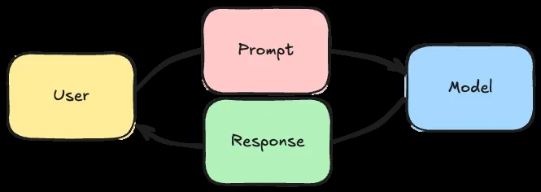
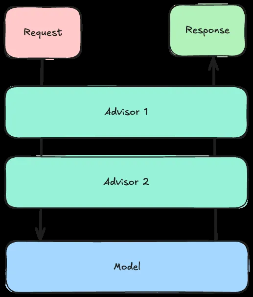
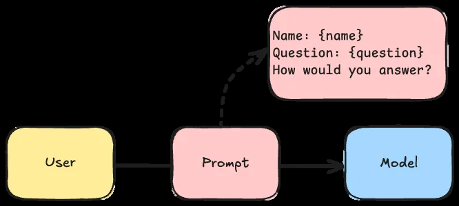
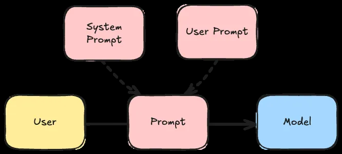
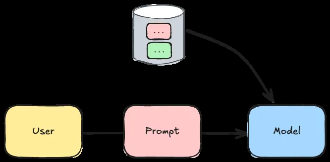
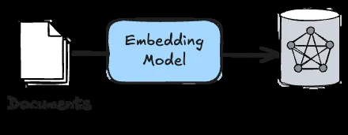
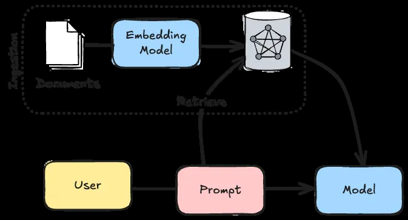
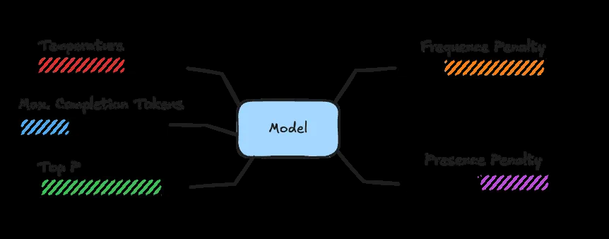
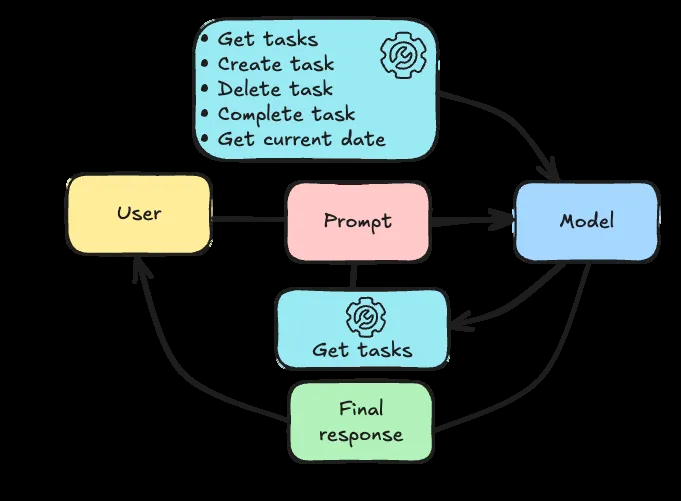
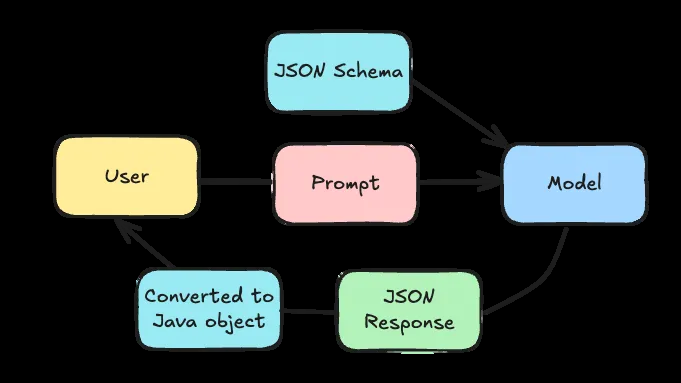

# Integrando IA na sua aplicação com Spring AI 

## Sumário

1. Como integrar com um modelo de chat

2. Técnicas de prompting

    - 2.1 Templating

    - 2.2 Suporte a JSON (delimitadores)

    - 2.3 Templating avançado (validação)

3. Prompt de **Sistema** vs Prompt de **Usuário**

4. Memória conversacional (Advisors de memória)

5. RAG — *Retrieval Augmented Generation* (ingestão + busca vetorial)

6. Ajustando parâmetros do modelo

    - Temperature

    - Maximum Completion Tokens

    - Top P

    - Frequency Penalty

    - Presence Penalty

7. *Tool Calling* e **MCP (Model Context Protocol)**

8. Técnicas de resposta

    - 8.1 *SafeGuard*

    - 8.2 Resposta estruturada (via *prompting* e via *response format*)

9. Conclusão


---

## 1) Como integrar com um modelo de chat

Apesar de existirem vários provedores de LLMs (**OpenAI, DeepSeek, Claude, Mistral**, etc.), a mecânica básica é a mesma: sua aplicação envia um **prompt** e o modelo retorna a sequência de palavras mais provável.



O **Spring AI** fornece uma camada de abstração com o **`ChatClient`** (similar ao `RestClient` / `JdbcClient`), permitindo alternar de provedor com trocas mínimas de dependência e propriedades — sem reescrever seu código.


### Exemplo: uso básico do `ChatClient`

```java
String response = chatClient
    .prompt()
    .user("Tell me a joke")
    .call()
    .content();
```


### OpenAI — Dependência e propriedade

```xml
<dependency>
    <groupId>org.springframework.ai</groupId>
    <artifactId>spring-ai-starter-model-openai</artifactId>
</dependency>
```

```properties
spring.ai.openai.api-key=${OPENAI_API_KEY}
```


### Ollama — Dependência

```xml
<dependency>
    <groupId>org.springframework.ai</groupId>
    <artifactId>spring-ai-starter-model-ollama</artifactId>
</dependency>
```


> Nem todos os modelos suportam os mesmos recursos (por exemplo, *tool calling*). Verifique a tabela de capacidades na documentação do Spring AI para escolher o provedor/modelo adequado.


---

## 2) Técnicas de prompting

O Spring AI oferece a **Advisor API** para transformar/inspecionar a requisição e resposta. Em termos práticos:

1. *Advisors* podem **mutar** o `AdvisedRequest` (texto e parâmetros do prompt).

2. O último *advisor* envia o pedido ao LLM.

3. Os *advisors* recebem o `AdvisedResponse` para pós‑processamento.



### 2.1) Templating

Você pode usar **templates** de prompt (ex.: StringTemplate) para incluir contexto (usuário, data atual, lista de tarefas, etc.).



**Exemplo de template** (`src/main/resources/user.st`):

```text
Given the following information:

User's name: {name}
Current date in ISO format (YYYY-MM-DD): {date}
Tasks:
{tasks:{task|
- Task:
    - ID: {task.id}
    - Description: {task.description}
    - Due Date: {task.dueDate}
    - Completed: {task.completed}
}}

How would you answer the following question:
"{question}"
```


**Registrando o template no `ChatClient`:**

```java
@Bean
ChatClient chatClient(ChatClient.Builder builder) {
    return builder
        .defaultUser(new ClassPathResource("user.st"))
        .build();
}
```


**Passando parâmetros dinamicamente:**

```java
String response = chatClient
    .prompt()
    .user(spec -> spec
        .param("tasks", taskService.findAll())
        .param("question", question)
        .param("dueDate", LocalDate.now())
        .param("name", userService.findName()))
    .call()
    .content();
```


### 2.2) Suporte a JSON (delimitadores)

Se o conteúdo do *prompt* contiver **chaves** (por exemplo JSON), o `StTemplateRenderer` padrão pode reprocessar o template e lançar erro. A solução é **alterar os delimitadores** do template (ex.: `<` e `>`):

```java
@Bean
ChatClient chatClient(ChatClient.Builder builder) {
    return builder
        .defaultUser(new ClassPathResource("user.st"))
        .defaultTemplateRenderer(StTemplateRenderer
            .builder()
            .startDelimiterToken('<')
            .endDelimiterToken('>')
            .build())
        .build();
}
```


> Importante: ao mudar os delimitadores, ajuste também os **templates parciais** usados por outros *advisors* (ex.: *PromptChatMemoryAdvisor*).


### 2.3) Templating avançado (validação)

Por padrão, o `StTemplateRenderer` exige que **cada placeholder** exista nos parâmetros (o que impede *loops* como `{tasks:{task| ... }}`). Desabilite a validação para suportar estruturas aninhadas:

```java
@Bean
ChatClient chatClient(ChatClient.Builder builder) {
    return builder
        .defaultUser(new ClassPathResource("user.st"))
        .defaultTemplateRenderer(StTemplateRenderer
            .builder()
            .validationMode(ValidationMode.NONE)
            .build())
        .build();
}
```


---

## 3) Prompt de Sistema vs. Prompt de Usuário

Diretrizes estáveis (tom de voz, formatação, idioma, regras) devem ir no **prompt de sistema**; o **prompt de usuário** contém a pergunta/variáveis.



**Registrando `system.st`:**

```java
@Bean
ChatClient chatClient(ChatClient.Builder builder) {
    return builder
        .defaultUser(new ClassPathResource("user.st"))
        .defaultSystem(new ClassPathResource("system.st"))
        .build();
}
```


---

## 4) Memória conversacional (Advisors de memória)

Para que o modelo “lembre” do diálogo, o cliente normalmente **reenvia** mensagens anteriores. 



O Spring AI fornece três abordagens:

- `MessageChatMemoryAdvisor`: envia o histórico usando a **API do provedor** (quando suportado).
- `PromptChatMemoryAdvisor`: **injeta** o histórico **no prompt**.
- `VectorStoreChatMemoryAdvisor`: também injeta no prompt, mas **seleciona apenas mensagens relevantes** (via busca vetorial).

> Além de configurar o *advisor*, é necessário **definir um Conversation ID** estável por usuário/diálogo para isolar memórias.


---

## 5) RAG — *Retrieval Augmented Generation*

LLMs têm **corte de conhecimento** e **não** conhecem seus dados privados. O RAG injeta **trechos relevantes** dos seus documentos no *prompt*. 



O fluxo típico:



1. **Ingestão**: ler documentos (PDF, HTML, texto, etc.) com *document readers*.

2. **Embeddings**: converter textos em vetores (numéricos).

3. **Armazenamento**: salvar vetores em um **vector store** (PGVector, Neo4j, Cassandra, etc.).

4. **Consulta**: a cada pergunta, buscar **trechos relevantes** e adicioná-los ao *prompt* via *advisor* (ex.: `QuestionAnswerAdvisor`).


### Dependências úteis (exemplos)

Leitor de PDF:

```xml
<dependency>
    <groupId>org.springframework.ai</groupId>
    <artifactId>spring-ai-pdf-document-reader</artifactId>
</dependency>
```


PGVector:

```xml
<dependency>
    <groupId>org.springframework.ai</groupId>
    <artifactId>spring-ai-starter-vector-store-pgvector</artifactId>
</dependency>
```


Advisors de vetor:

```xml
<dependency>
    <groupId>org.springframework.ai</groupId>
    <artifactId>spring-ai-advisors-vector-store</artifactId>
</dependency>
```


> A ingestão geralmente é **processo separado** da chamada ao *chat* (executada em *boot* ou *job* dedicado).


---

## 6) Ajustando parâmetros do modelo

Parâmetros comuns para **equilibrar criatividade x precisão**:



- **Temperature** (0–1): próximo de **0** → mais determinístico; próximo de **1** → mais criativo.
- **Maximum Completion Tokens**: limite de tokens de **resposta** (respostas mais curtas com limites menores).
- **Top P** (0–1): *nucleus sampling*; restringe o conjunto de candidatos por probabilidade cumulativa (use **ou** `temperature`, evite combinar ambos).
- **Frequency Penalty** (-2 a +2): penaliza **repetição** de termos.
- **Presence Penalty** (-2 a +2): incentiva **novos tópicos** (penaliza permanecer no mesmo assunto).


### Configuração por propriedades

```properties
spring.ai.openai.chat.options.frequency-penalty=0.5
spring.ai.openai.chat.options.presence-penalty=0.5
spring.ai.openai.chat.options.temperature=0.5
spring.ai.openai.chat.options.top-p=0.9
spring.ai.openai.chat.options.max-completion-tokens=1000
```


### Configuração via *builder*

```java
@Bean
ChatClient chatClient(ChatClient.Builder builder) {
    return builder
        .defaultOptions(OpenAiChatOptions.builder()
            .frequencyPenalty(0.5d)
            .presencePenalty(0.5d)
            .temperature(0.5d)
            .topP(0.9d)
            .maxTokens(1000)
            .build())
        .build();
}
```


---

## 7) *Tool Calling* e **MCP (Model Context Protocol)**

Com *tool calling*, o LLM pode **solicitar** que o runtime execute **métodos/anotações** e retorne resultados (ex.: criar tarefa, listar tarefas, obter data atual), repetindo o ciclo até produzir a resposta final ao usuário.



**Classe de ferramentas com `@Tool`:**

```java
@Component
@RequiredArgConstructor
class TaskTools {
   private final TaskService taskService;

   @Tool(description = "get all tasks")
   public List<Task> getTasks() {
      return taskService.getAll();
   }

   @Tool(description = "create a task")
   public Task createTask(
           @ToolParam(description = "the description of the task") String description,
           @ToolParam(description = "The due date of the task in ISO format (YYYY-MM-DD)") String dueDate) {
      return taskService.create(description, LocalDate.parse(dueDate));
   }

   @Tool(description = "delete a task")
   public void deleteTask(
           @ToolParam(description = "the id of the task") long id) {
      taskService.delete(id);
   }

   @Tool(description = "toggle the completion of a task")
   public Task toggleTask(
           @ToolParam(description = "the id of the task") long id) {
      return taskService.toggle(id);
   }

   @Tool(description = "get the current date in ISO format (YYYY-MM-DD)")
   public LocalDate getCurrentDate() {
      return LocalDate.now();
   }
}
```


> Observação: a resposta do método deve ser **serializável em JSON** (evitar relacionamentos bidirecionais e tipos funcionais/assíncronos como `Optional`, `Function`, `Flux`, `Mono`, `CompletableFuture`, etc.).


**Registrando as ferramentas no `ChatClient`:**

```java
@Bean
ChatClient chatClient(ChatClient.Builder builder, TaskTools taskTools) {
   return builder
           .defaultTools(taskTools)
           .build();
}
```


### MCP — visão geral

O **MCP** leva a ideia de *tool calling* para o ecossistema: **servidores MCP** expõem ferramentas via API; um **cliente MCP** (p.ex. uma UI local) conversa com o LLM e **orquestra** as chamadas aos servidores MCP (em vez de o Spring AI orquestrar).


---

## 8) Técnicas de resposta


### 8.1) *SafeGuard*

Você pode **bloquear termos** indesejados e retornar erro quando aparecerem no output:



```java
@Bean
ChatClient chatClient(ChatClient.Builder builder) {
    return builder
        .defaultAdvisors(
            new SafeGuardAdvisor(List.of(
                "badword1",
                "badword2"
            ))
        )
        .build();
}
```


### 8.2) Resposta estruturada

Há duas abordagens:

**(a) Por *prompting*** — o Spring AI gera um **JSON Schema** a partir de uma classe, injeta no *prompt* e tenta mapear a resposta:


```java
ResponseType response = chatClient
    .prompt()
    .user(question)
    .call()
    .entity(ResponseType.class);
```


> Como LLMs são não determinísticos, sempre implemente **fallbacks**/retries e validação de JSON.


**(b) Por *response format*** — quando o provedor permite especificar o **formato** diretamente (ex.: OpenAI JSON Mode/Schema):

```java
@Bean
ChatClient chatClient(ChatClient.Builder builder) {
    String jsonSchema = """
    {
        "type": "object",
        "properties": {
            "steps": {
                "type": "array",
                "items": {
                    "type": "object",
                    "properties": {
                        "explanation": {
                            "type": "string"
                        },
                        "output": {
                            "type": "string"
                        }
                    },
                    "required": ["explanation", "output"],
                    "additionalProperties": false
                }
            },
            "final_answer": {
                "type": "string"
            }
        },
        "required": ["steps", "final_answer"],
        "additionalProperties": false
    }
    """;

    return builder
        .defaultOptions(OpenAiChatOptions.builder()
            .responseFormat(ResponseFormat
                .builder()
                .type(ResponseFormat.Type.JSON_OBJECT)
                .jsonSchema(ResponseFormat.JsonSchema
                    .builder()
                    .schema(jsonSchema)
                    .strict(true)
                    .build())
                .build())
            .build())
        .build();
}
```

Se já existir uma classe Java, use `BeanOutputConverter` para **gerar o schema** e **converter** a resposta:

```java
@Bean
BeanOutputConverter<MyResponse> myResponseConverter() {
   return new BeanOutputConverter<MyResponse>();
}

@Bean
ChatClient chatClient(ChatClient.Builder builder, BeanOutputConverter<MyResponse> myResponseConverter) {
   return builder
           .defaultOptions(OpenAiChatOptions.builder()
                   .responseFormat(ResponseFormat
                           .builder()
                           .type(ResponseFormat.Type.JSON_OBJECT)
                           .jsonSchema(ResponseFormat.JsonSchema
                                   .builder()
                                   .schema(myResponseConverter.getJsonSchema())
                                   .strict(true)
                                   .build())
                           .build())
                   .build())
           .build();
}
```

E, ao consumir:

```java
String jsonResponse = chatClient
    .prompt()
    .user(question)
    .call()
    .content();

MyResponse response = converter.convert(jsonResponse);
```


> Nota: existe/ existia **bug** na configuração via propriedade `spring.ai.openai.chat.options.response-format.schema`; a alternativa robusta é definir via `OpenAiChatOptions` como acima.


---

## 9) Conclusão

Integrar LLMs no seu app **Spring Boot** abre portas para experiências ricas (assistentes, automação, busca semântica, etc.). O **Spring AI** fornece um conjunto robusto de módulos (mesmo em fase de *milestone/RC*) que aceleram desde *chat* e *tool calling* até *RAG* e respostas estruturadas.  
Atente para **limitações/bugs** momentâneos, boas práticas de **prompting**, **validação** de respostas e **custos** (token window, ingestão, *retrieval*).
