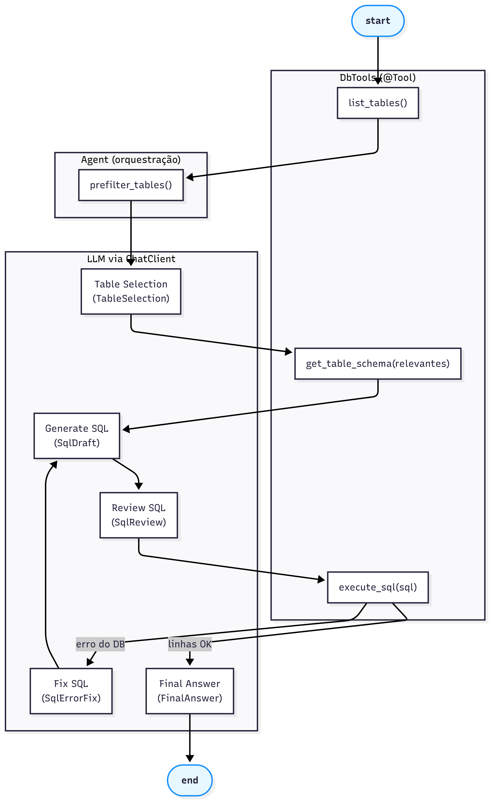

# Construindo um **SQL Agent** com Spring Boot + Spring AI (inspirado no LangGraph)

Este tutorial descreve, passo a passo, como criar um **agente SQL** em Java usando **Spring Boot** e **Spring AI**, inspirado no guia “Build a SQL agent” do LangGraph. A implementação adapta a lógica do fluxo original para o ecossistema Spring, com foco em **structured output**, **Ferramentas (@Tool)** e **robustez** contra erros comuns.

> Referência conceitual: [LangGraph — SQL agent tutorial](https://github.com/langchain-ai/langgraph/blob/main/docs/docs/tutorials/sql/sql-agent.md)

---

## Objetivo

O agente responde perguntas em linguagem natural consultando um banco de dados SQL. O fluxo é:

1. Conecta ao banco
2. Lista as tabelas
3. Seleciona as tabelas relevantes para a pergunta
4. Busca os esquemas das tabelas relevantes
5. Gera uma consulta SQL com base na pergunta+schemas
6. Revisa a consulta com LLM (erros comuns)
7. Executa a consulta
8. Se der erro, corrige automaticamente e tenta novamente
9. Gera uma resposta final baseada nos resultados

---

## Visão Geral da Arquitetura

```
+-------------------------------+
| Spring Boot Application       |
|  (Main, DemoRunner)           |
+---------------+---------------+
                |
                v
       +--------+---------+
       | SqlAgent         | <- Orquestra o fluxo 1..9
       |  - ChatClient    |
       |  - TemplateRenderer (< >)  
       |  - BeanOutputConverter      (structured output JSON)
       +--------+---------+
                |
   +------------+------------+
   |                         |
   v                         v
DbTools (@Tool)         Prompts (templates <...>)
- listTables()          - TABLE_SELECTOR_PROMPT
- getTableSchema()      - SQL_GENERATOR_PROMPT
- executeSql()          - SQL_REVIEW_PROMPT
                        - SQL_ERROR_FIX_PROMPT
                        - FINAL_ANSWER_PROMPT
```
* **Spring AI `ChatClient`**: interage com o LLM, injeta prompts e (opcionalmente) expõe tools.
* **`TemplateRenderer` (StringTemplate)**: usamos **delimitadores `<...>`** para evitar conflitos com JSON `{...}` dentro dos prompts.
* **`BeanOutputConverter`**: garante **structured output** (o LLM devolve **uma linha JSON** que deserializamos).
* **`DbTools`**: ferramentas anotadas com `@Tool` para listar tabelas, obter esquema e executar consultas em **modo seguro (SELECT-only)**.

---
## Grafo

---
## Estrutura de Pastas (projeto exemplo)

```
src/main/java/br/com/itss/agentic/ai/
  ├─ Main.java
  ├─ DemoRunner.java
  ├─ TemplateConfig.java
  ├─ Prompts.java
  ├─ SqlAgent.java
  ├─ model/
  │   └─ Models.java      (TableSelection, SqlDraft, SqlReview, SqlErrorFix, FinalAnswer)
  └─ tools/
      └─ DbTools.java
src/main/resources/
  └─ application.properties
pom.xml
```

---

## Dependências (pom.xml)

Principais bibliotecas:

* **Spring Boot 3.5.x**
* **Spring AI 1.0.x** (provider OpenAI como exemplo)
* **JDBC + PostgreSQL**
* **Jackson** (auxiliar para JSON)

```xml
<dependencyManagement>
  <dependencies>
    <dependency>
      <groupId>org.springframework.boot</groupId>
      <artifactId>spring-boot-dependencies</artifactId>
      <version>3.5.5</version>
      <type>pom</type>
      <scope>import</scope>
    </dependency>
    <dependency>
      <groupId>org.springframework.ai</groupId>
      <artifactId>spring-ai-bom</artifactId>
      <version>1.0.1</version>
      <type>pom</type>
      <scope>import</scope>
    </dependency>
  </dependencies>
</dependencyManagement>

<dependencies>
  <dependency>
    <groupId>org.springframework.boot</groupId>
    <artifactId>spring-boot-starter</artifactId>
  </dependency>

  <dependency>
    <groupId>org.springframework.boot</groupId>
    <artifactId>spring-boot-starter-jdbc</artifactId>
  </dependency>
  <dependency>
    <groupId>org.postgresql</groupId>
    <artifactId>postgresql</artifactId>
    <scope>runtime</scope>
  </dependency>

  <dependency>
    <groupId>org.springframework.ai</groupId>
    <artifactId>spring-ai-openai-spring-boot-starter</artifactId>
  </dependency>

  <dependency>
    <groupId>com.fasterxml.jackson.core</groupId>
    <artifactId>jackson-databind</artifactId>
  </dependency>
</dependencies>
```

---

## Configuração (application.properties)

```properties
spring.application.name=sql-agent

# Provider (ex.: OpenAI)
spring.ai.openai.api-key=${OPENAI_API_KEY}
spring.ai.openai.chat.options.model=gpt-4o-mini
spring.ai.openai.chat.options.temperature=0.0

# Banco de dados (PostgreSQL)
spring.datasource.url=jdbc:postgresql://localhost:5432/sampledb
spring.datasource.username=postgres
spring.datasource.password=postgres
spring.datasource.hikari.maximum-pool-size=5

# Logs
logging.level.root=INFO
logging.level.br.com.itss.agentic.ai=DEBUG
logging.level.org.springframework.ai=INFO
```

> **Nota:** não existe propriedade `spring.ai.template.engine=st`. O renderer é configurado via código (ver `TemplateConfig` abaixo).

---

## `TemplateConfig` — delimitadores `<...>`

Para evitar conflito do parser com JSON `{...}` incluído nos prompts, usamos **StringTemplate** com **delimitadores `<` e `>`**.

```java
@Configuration
public class TemplateConfig {

  @Bean
  TemplateRenderer templateRenderer() {
    return StTemplateRenderer.builder()
        .startDelimiterToken('<')
        .endDelimiterToken('>')
        .build();
  }

  @Bean
  ChatClient chatClient(ChatClient.Builder builder, TemplateRenderer templateRenderer) {
    return builder
        .defaultTemplateRenderer(templateRenderer)
        .build();
  }
}
```

---

## Modelos (structured output)

Usamos **records** mapeados por `BeanOutputConverter`. O LLM deve responder **em uma única linha JSON**:

```java
public record TableSelection(List<String> tables, String reason) {}
public record SqlDraft(String sql, String thoughts) {}
public record SqlReview(boolean ok, String issues, String fixed_sql) {}
public record SqlErrorFix(String sql, String reason) {}
public record FinalAnswer(String answer, String sql) {}
```

---

## Prompts

Os prompts seguem a mesma ideia do tutorial do LangGraph, adaptados para `<placeholders>`:

```java
public static final String TABLE_SELECTOR_PROMPT = """
  Você é um agente SQL...
  Responda em UMA ÚNICA LINHA JSON:
  {"tables":["t1","t2"],"reason":"..."}
  Pergunta: <question>
  Tabelas disponíveis: <tables>
  """;
```

*(Também há prompts para geração, revisão, correção de SQL e resposta final.)*

---

## DbTools — Ferramentas de Banco (@Tool)

Implementadas com **Spring AI Tools** e **JDBC**, com **restrições de segurança**:

```java
@Component
public class DbTools {

  @Tool(name="list_tables",
        description="Lista tabelas públicas disponíveis no banco (schema 'public').")
  public List<String> listTables() { ... } // SELECT 1 coluna -> List<String>

  @Tool(name="get_table_schema",
        description="Retorna colunas/tipos e PK via information_schema.")
  public String getTableSchema(String table) { ... } // List<Map<String,Object>> + PK

  @Tool(name="execute_sql",
        description="Executa UMA SELECT. Injeta LIMIT 100 se ausente.")
  public List<Map<String,Object>> executeSql(String sql) {
    // Apenas SELECT, sem ponto-e-vírgula, LIMIT 100 se não houver
  }
}
```

**Dicas de robustez implementadas:**

* `execute_sql`: só permite **uma** instrução `SELECT`, sem `;`, adiciona `LIMIT 100`.
* Esquema de PK via `information_schema` (portável e sem `regclass`).
* Logs com tempo, número de linhas, etc.

---

## SqlAgent — Orquestração do Fluxo

O **SqlAgent** gerencia os 9 passos, usando:

* `TemplateRenderer` para **pré-renderizar** os prompts base (substituir `<question>`, `<tables>`, etc.)
* `BeanOutputConverter` + `getFormat()` para **constranger o LLM** a JSON válido
* Conversão manual via `convert(raw)` com **fallbacks** (limpeza de \`\`\`json, extração de `{...}`)

### Trechos-chave

**Pré-render + anexar formato (evita parser quebrar com `{}`):**

```java
var conv = new BeanOutputConverter<>(TableSelection.class);
String format = conv.getFormat();

String base = renderer.apply(Prompts.TABLE_SELECTOR_PROMPT,
    Map.of("question", question, "tables", String.join(", ", tables)));

String prompt = base + "\n\nSiga EXATAMENTE este formato:\n" + format;

String raw = chat.prompt().user(prompt).call().content();
TableSelection selection = safeConvert(conv, raw, TableSelection.class);
```

**Pré-filtro de tabelas** (quando há muitas, reduz tokens mantendo relevância):

```java
List<String> tables = prefilterTables(allTables, question, 200);
```

**Laço de execução + autocorreção (etapas 6–8):**

```java
while (true) {
  try {
    rows = db.executeSql(sql);
    break;
  } catch (Exception ex) {
    // Prompt de correção estruturado
    var fixConv = new BeanOutputConverter<>(SqlErrorFix.class);
    String fixBase = renderer.apply(Prompts.SQL_ERROR_FIX_PROMPT,
        Map.of("sql", sql, "db_error", ex.getMessage(), "schemas", schemasStr));
    String fixPrompt = fixBase + "\n\nSiga EXATAMENTE este formato:\n" + fixConv.getFormat();
    String fixRaw = chat.prompt().user(fixPrompt).call().content();
    SqlErrorFix fix = safeConvert(fixConv, fixRaw, SqlErrorFix.class);
    sql = Optional.ofNullable(fix).map(SqlErrorFix::sql).filter(s -> !s.isBlank())
          .orElseThrow(() -> new IllegalStateException("Correção ausente"));
  }
}
```

**Resposta final (etapa 9):**

```java
String tableMd = formatRowsAsMarkdown(rows, 20);
var ansConv = new BeanOutputConverter<>(FinalAnswer.class);
String ansBase = renderer.apply(Prompts.FINAL_ANSWER_PROMPT,
    Map.of("question", question, "sql", sql, "result_table", tableMd));
String ansPrompt = ansBase + "\n\nSiga EXATAMENTE este formato:\n" + ansConv.getFormat();
String ansRaw = chat.prompt().user(ansPrompt).call().content();
FinalAnswer answer = safeConvert(ansConv, ansRaw, FinalAnswer.class);
```

---

## DemoRunner — Executando um exemplo

```java
@Configuration
public class DemoRunner {
  @Bean
  CommandLineRunner runSqlAgent(SqlAgent agent) {
    return args -> {
      var res = agent.answer("Liste as top 5 ordens de serviço", 3);
      System.out.println("\n===== RESPOSTA =====\n" + res.answer());
      System.out.println("\n===== SQL =====\n" + res.sql());
    };
  }
}
```

---

## Como Rodar

1. **Banco de Dados:** suba um PostgreSQL local e crie algumas tabelas de teste.
2. **Variáveis de ambiente:**

   ```bash
   export OPENAI_API_KEY=sk-...
   ```
3. **Ajuste** `spring.datasource.*` em `application.properties`.
4. **Execute:**

   ```bash
   ./mvnw spring-boot:run
   ```
5. Observe os **logs** do pipeline (tabelas, seleção, SQL gerado, revisão, execução, correções).

---

## Mapeamento do Fluxo (1–9) na Implementação

1. **Acessar DB:** `JdbcTemplate` configurado via Spring Boot (HikariCP).
2. **Listar tabelas:** `DbTools.listTables()` (consulta em `information_schema.tables`).
3. **Selecionar relevantes:** prompt `TABLE_SELECTOR_PROMPT` + `BeanOutputConverter<TableSelection>`.
4. **Schemas:** `DbTools.getTableSchema()` (colunas/tipos + PK por `information_schema`).
5. **Gerar SQL:** prompt `SQL_GENERATOR_PROMPT` + `BeanOutputConverter<SqlDraft>`.
6. **Validar SQL:** prompt `SQL_REVIEW_PROMPT` + `BeanOutputConverter<SqlReview>` (corrige `fixed_sql` se necessário).
7. **Executar SQL:** `DbTools.executeSql()` (SELECT-only + LIMIT).
8. **Corrigir em loop:** prompt `SQL_ERROR_FIX_PROMPT` → `BeanOutputConverter<SqlErrorFix>` até sucesso ou limite.
9. **Resposta final:** prompt `FINAL_ANSWER_PROMPT` → `BeanOutputConverter<FinalAnswer>`; inclui tabela Markdown.

---

## Boas Práticas & Segurança

* **SELECT-only** e **uma instrução por vez** (sem `;`) para evitar efeitos colaterais.
* **LIMIT automático** para evitar explosão de resultados.
* **Structured Output** para **contratos estáveis** entre LLM e código.
* **Delimitadores `<...>`** no template (evita conflito com JSON `{...}`).
* **Pré-render de prompts base** e **anexar schema depois** (impede o parser de “engolir” os formatos).
* **Logs** em cada etapa para diagnóstico (inclua prévias de saída do LLM).

---

## Problemas comuns & Soluções

* **`IncorrectResultSetColumnCount` em `getTableSchema`**
  Use `queryForList(sql, param...)` → `List<Map<String,Object>>` quando retornar **N colunas**, não `queryForList(sql, String.class)`.

* **Erro do Template Parser com `{...}` no prompt**
  Use **delimitadores `< >`** e **pré-render** o prompt base. Anexe `getFormat()` **depois** como texto plano.

* **LLM retorna vazio / não-JSON**
  `safeConvert(...)` com fallbacks: extrair primeiro `{...}`, remover cercas \`\`\`json, logar RAW para depuração.

* **655 tabelas? Prompt gigante!**
  Aplique **pré-filtro** simples por termos da pergunta para reduzir a lista (ex.: top 200).

* **Lambda “efetivamente final”**
  Em lambdas, use **cópias finais** (`final String varForLambda = ...`) se a variável for reassinada depois.

---

## Extensões Sugeridas

* Cache de **schemas** por sessão.
* Whitelist de **tabelas/colunas** por domínio/tenant.
* **RAG** sobre documentação do banco (dicionário de dados).
* **Ferramentas adicionais**: geração de gráficos, export CSV/Parquet, explicação de plano de execução.
* Suporte a **outros bancos** (MySQL, MSSQL, etc.) ajustando metadados.

---

## Links Úteis

* LangGraph: **Build a SQL agent** (conceitos e fluxo)
  [https://github.com/langchain-ai/langgraph/blob/main/docs/docs/tutorials/sql/sql-agent.md](https://github.com/langchain-ai/langgraph/blob/main/docs/docs/tutorials/sql/sql-agent.md)

* Spring AI — ChatClient, Tools e Structured Output
  [https://docs.spring.io/spring-ai/reference/](https://docs.spring.io/spring-ai/reference/)

* PostgreSQL — `information_schema`
  [https://www.postgresql.org/docs/current/infoschema.html](https://www.postgresql.org/docs/current/infoschema.html)

---

**Pronto!** Com este guia você tem uma base sólida para construir, entender e evoluir um **SQL Agent** em Java com Spring Boot AI, seguindo o fluxo e as melhores práticas do tutorial do LangGraph, mas adaptado ao ecossistema Spring.
